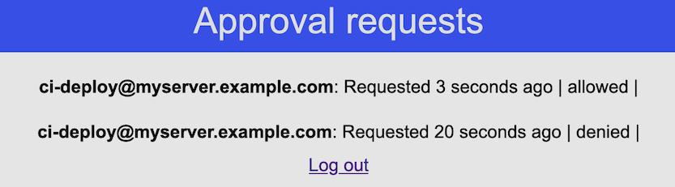
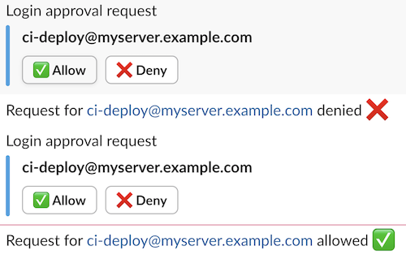

# Collaborative Push Approvals

Continuous deployment demands privileged access to servers and APIs. This results in elevated risk to sensitive systems  via vulnerabilities in CI/CD systems with a huge attack surface e.g. Gitlab

Push based approvals for teams can help reduce this risk.

It uses a sqlite database to keep track of approval requests and approver accounts.

```
[-.-]:collaborative-push-approvals$ sqlite3 collaborative-push-approvals.db
SQLite version 3.39.5 2022-10-14 20:58:05
Enter ".help" for usage hints.
sqlite> .schema
CREATE TABLE clients (id INTEGER PRIMARY KEY, username TEXT NOT NULL, password TEXT NOT NULL);
CREATE TABLE approvers (id TEXT PRIMARY KEY, username TEXT NOT NULL, password_hash TEXT NOT NULL);
CREATE TABLE requests (request_id TEXT primary key not null, request_info TEXT not null, created_at DATETIME not null, status TEXT not null);
```

Default admin username and password are `admin` and `password` respectively, for clients (approval requests) they are `client` and `password`.

## Environment variables

- `SESSION_SECRET` for session management
- `SLACK_URL`, a slack webhook URL to interact via slack

## Integration with PAM and SSH

To integrate it with `PAM` for SSH, it can be utilized with `pam_exec.so` as follows in `/etc/pam.d/sshd`:

```
account required pam_exec.so /usr/local/bin/push-auth-pam-script.sh
auth  requisite pam_deny.so
auth  required pam_permit.so
```

A functional script exists in this repository under `scripts`.

## Key features

- Slack based interface to approve, deny login requests (optional)
- Web interface to be used as alternate interface
- Force 2FA for selected accounts or groups via filtering in shell script for `pam_exec`

## Screenshots

## Web interface




# Slack based workflow



## TODO

- Time-range approvals to allow-multiple-logins-with-one-approval instead of approve-each-login
- Ability to create new approvers, clients via web interface
- Signed client keys and secrets instead of basic auth to send and check status of approval requests
- Use interactive slack apps
- Integration of more deployment scenarios e.g. API access instead of SSH to privileged endpoints

## Why?

- https://stackoverflow.com/beta/discussions/77084750/are-you-using-2fa-with-your-cicd-tool
- https://www.reddit.com/r/gitlab/comments/hol3ti/how_to_2fa_in_gitlab_ci_pipeline/
- https://github.com/kubernetes/kubernetes/issues/14362

__Disclaimer__: this is a weekend project, needs more love to be used in production.
